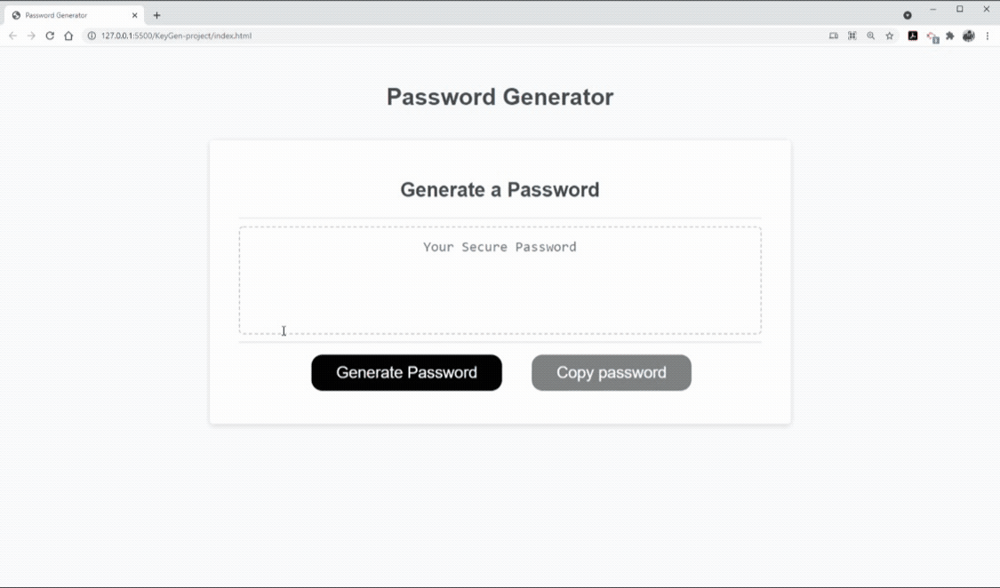
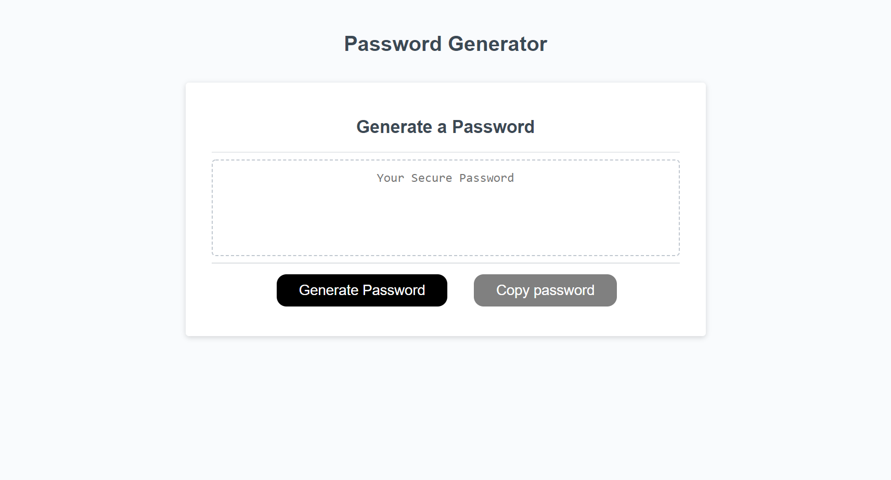

# KeyGen: Password Generator Project
## Description 

KeyGen is a password generator project that delivers a concise and effective password to the user. The project is designed to enhance the privacy and security of an individuals account, but also allows the whole process of a password to be seamless and accessible. 
The project was developed through HTML, CSS, and JavaScript as all of knowledge and skills merged into one project. This not only tested the existing skills but also developed them exponentially to tackle more challenging projects and systems. 

Through this initiative, the key understanding of JavaScript’s principles were gained and utilized to establish a password creator for visitor of the page.  
 
## Table of Contents - Web Portfolio - Gurtej Singh

- [Project](#Project)
- [Website](#Website)
- [License](#license)
- [Contribute](#contribute)

## Project
The following a live-demo of the password generator, detailing how the password is generator and what steps have to be undertaken in order to develope the password. 



The following screenshot, displays the interface of the password generator and the overall makeup and design of the page.



## Website

To access the website of the password generator, please click on the following link: 
https://gurtej154.github.io/KeyGen-project/

## License
Copyright (c) 2021 Gurtej Singh

Permission is hereby granted, free of charge, to any person obtaining a copy of this software and associated documentation files (the "Software"), to deal in the Software without restriction, including without limitation the rights to use, copy, modify, merge, publish, distribute, sublicense, and/or sell copies of the Software, and to permit persons to whom the Software is furnished to do so, subject to the following conditions:

The above copyright notice and this permission notice shall be included in all copies or substantial portions of the Software.

THE SOFTWARE IS PROVIDED "AS IS", WITHOUT WARRANTY OF ANY KIND, EXPRESS OR IMPLIED, INCLUDING BUT NOT LIMITED TO THE WARRANTIES OF MERCHANTABILITY, FITNESS FOR A PARTICULAR PURPOSE AND NONINFRINGEMENT. IN NO EVENT SHALL THE AUTHORS OR COPYRIGHT HOLDERS BE LIABLE FOR ANY CLAIM, DAMAGES OR OTHER LIABILITY, WHETHER IN AN ACTION OF CONTRACT, TORT OR OTHERWISE, ARISING FROM, OUT OF OR IN CONNECTION WITH THE SOFTWARE OR THE USE OR OTHER DEALINGS IN THE SOFTWARE.

## How to Contribute
To contribute, modify or edit in general; 
- Open Visual Studio Code
- Open or create a new project folder 
- Open a integrated terminal or git bash 
- Attain the repo link from this repository


```
HTTPS
https://github.com/gurtej154/KeyGen-project.git

or

SSH
git@github.com:gurtej154/KeyGen-project.git
```
- Enter git clone 
```
HTTPS
 git clone https://github.com/gurtej154/KeyGen-project.git

or

SSH
git clone git@github.com:gurtej154/KeyGen-project.git
```
- Start accessing the project's content!
